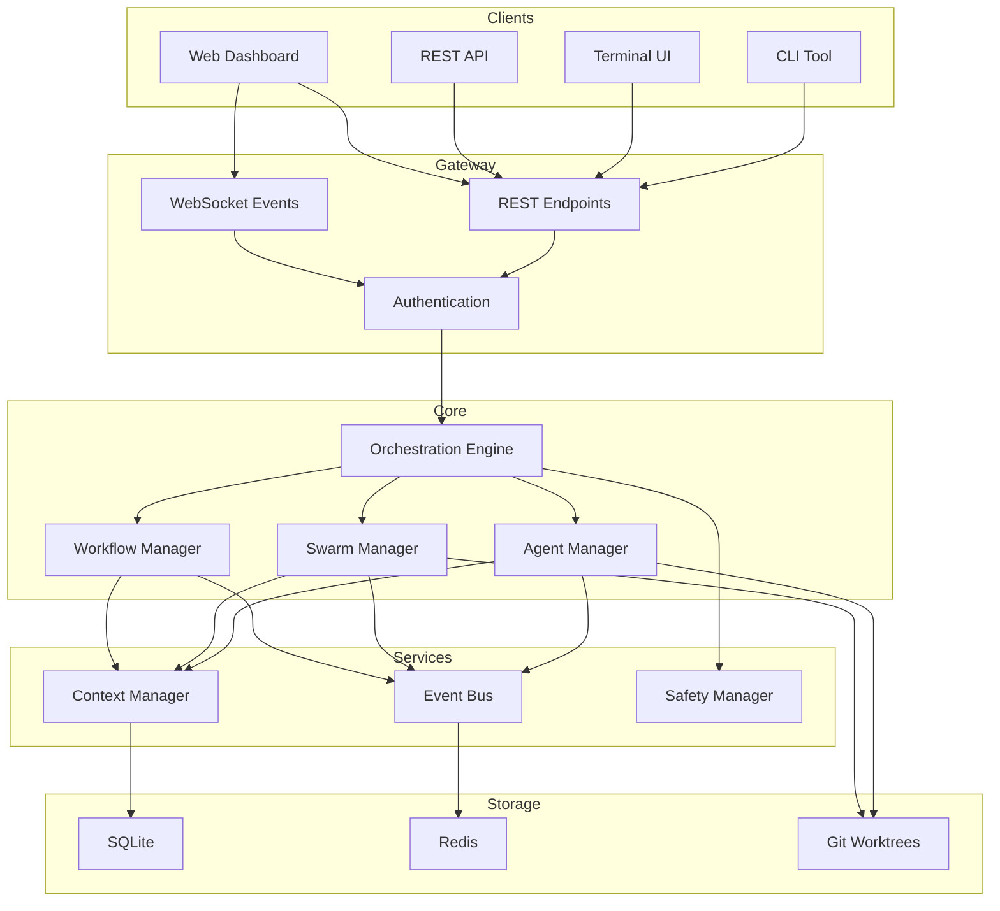

# Dash - Agent Orchestration Platform

<div align="center">

**Coordinate multiple AI agents to solve complex problems**

[](https://www.typescriptlang.org/)
[](https://nodejs.org/)
[](https://opensource.org/licenses/MIT/)
[](https://www.npmjs.com/package/@jtan15010/dash)

</div>

---

## What is Dash?

Dash is a **multi-agent orchestration platform** that coordinates AI agents to work together on complex tasks. Think of it as an operating system for AI agents.

### Key Concepts

| Concept | Description |
|---------|-------------|
| **Agent** | An AI worker that executes tasks (Claude, Kimi, GPT-4) |
| **Swarm** | A group of agents coordinated to solve a problem |
| **Workflow** | A defined sequence of steps for agents to execute |
| **Context** | Shared memory that agents use to coordinate |

## Architecture



### Core Components

**Orchestration Engine** - Coordinates all activities, distributes work, aggregates results.

**Agent Manager** - Spawns, monitors, and terminates AI agents. Handles lifecycle events.

**Swarm Manager** - Creates agent groups, manages coordination, balances load.

**Workflow Engine** - Executes multi-step workflows with dependencies and error handling.

**Context Manager** - Maintains shared state between agents and swarms.

**Event Bus** - Pub/sub system for real-time updates and logging.

**Safety Manager** - Validates all actions against safety policies.

## Agent Swarm Patterns

### Parallel Swarm

Multiple agents work simultaneously on the same task, results aggregated.

```
Agent A1 ─┐
Agent A2 ─┼─► Results Aggregated
Agent A3 ─┘
```

**Use for:** Independent subtasks, search, data collection.

### Sequential Swarm

Each agent waits for the previous to complete.

```
Agent A1 ──► Agent A2 ──► Agent A3 ──► Agent A4
```

**Use for:** Pipeline tasks, code → review → test → deploy.

### Hierarchical Swarm

A leader agent coordinates worker agents.

```
           ┌──────────┐
           │  Leader  │
           └────┬─────┘
         ┌─────┼─────┐
         ▼     ▼     ▼
       A1    A2    A3
```

**Use for:** Complex coordination, task decomposition.

## Quick Start

```bash
# Clone and install
git clone https://github.com/davidkimai/dash.git
cd dash
npm install
npm run build

# Check version
./dist/src/index.js --version

# Start API server
./dist/src/index.js dashboard --headless --port 7373
```

### CLI Commands

```bash
# System status
dash status

# Agent operations
dash agent list              # List all agents
dash agent spawn "Task"    # Create agent
dash agent terminate <id>   # Stop agent

# Swarm operations
dash swarm list             # List swarms
dash swarm create --name my-swarm --task "Task"

# Workflow operations
dash workflow list
dash workflow run <id>
```

### Programmatic API

```typescript
import { createApp } from 'dash';

const app = await createApp({ port: 7373 });

// Create agent
const agent = await app.agents.create({
  model: 'kimi-k2.5',
  task: 'Research AI agents',
  context: { priority: 'high' }
});

// Create swarm
const swarm = await app.swarms.create({
  name: 'research-team',
  agents: [agent1, agent2, agent3],
  strategy: 'parallel'
});

// Execute workflow
const result = await app.workflows.execute({
  name: 'analysis-pipeline',
  steps: [...]
});
```

## Project Structure

```
dash/
├── src/
│   ├── api/           # REST API endpoints
│   ├── cli/           # CLI commands
│   ├── core/         # Orchestration engine
│   ├── events/       # Event bus
│   ├── workflow/     # Workflow engine
│   ├── scheduling/   # Task scheduling
│   ├── scaling/      # Auto-scaling
│   ├── recovery/     # Fault tolerance
│   ├── safety/       # Safety checks
│   ├── storage/       # Database layer
│   ├── tracing/      # OpenTelemetry
│   └── dashboard/    # Web UI
├── dist/             # Compiled output
└── docs/             # Documentation
```

## Development

```bash
npm install              # Install dependencies
npm run dev             # Development mode
npm run typecheck       # TypeScript check
npm test               # Run tests
npm run build          # Production build
```

## Monitoring

Access the dashboard at `http://localhost:7373` when the server is running.

**Available metrics:**
- Active agents (running/idle/total)
- Swarm status (running/completed/failed)
- Task throughput
- Error rates
- Latency percentiles

## Documentation

| Document | Description |
|----------|-------------|
| [ARCHITECTURE.md](docs/ARCHITECTURE.md) | System design |
| [API.md](docs/API.md) | REST API reference |
| [CLI.md](docs/CLI.md) | CLI command reference |

## Docker

```bash
docker build -t dash .
docker run -p 7373:7373 dash
```

## Publishing

```bash
npm version patch   # 2.0.0 → 2.0.1
npm run build
npm publish --access public
```

## Contributing

1. Fork the repository
2. Create feature branch
3. Commit changes
4. Push to branch
5. Open Pull Request

## License

MIT License - see [LICENSE](LICENSE) for details.

## Acknowledgments

- Built with TypeScript, Fastify, and SQLite
- Inspired by [OpenClaw](https://github.com/openclaw/openclaw)
- Uses [Kimi](https://moonshot.ai/) for agent intelligence
