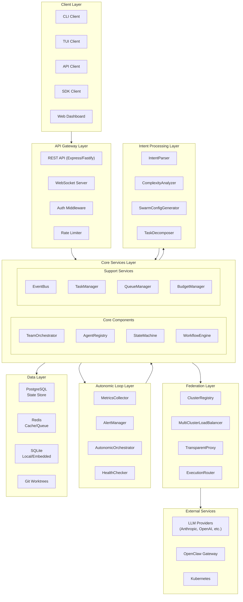
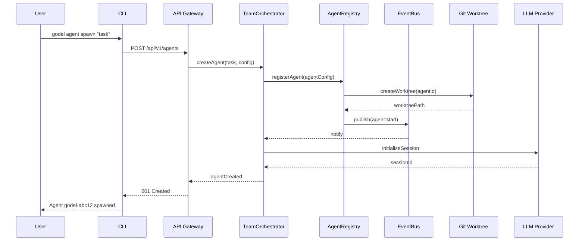
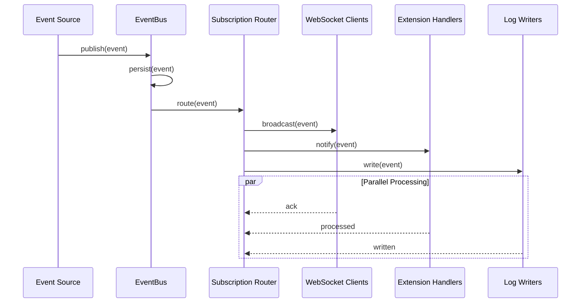
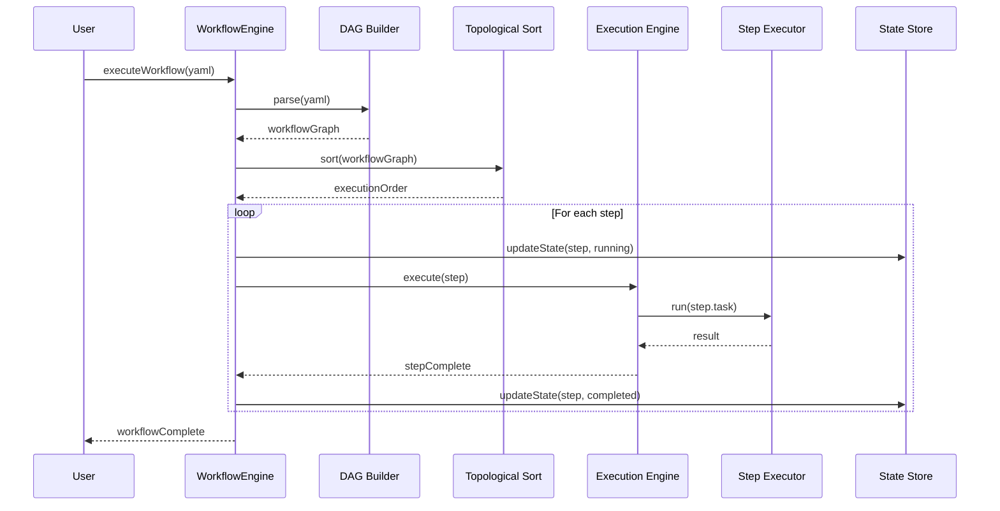
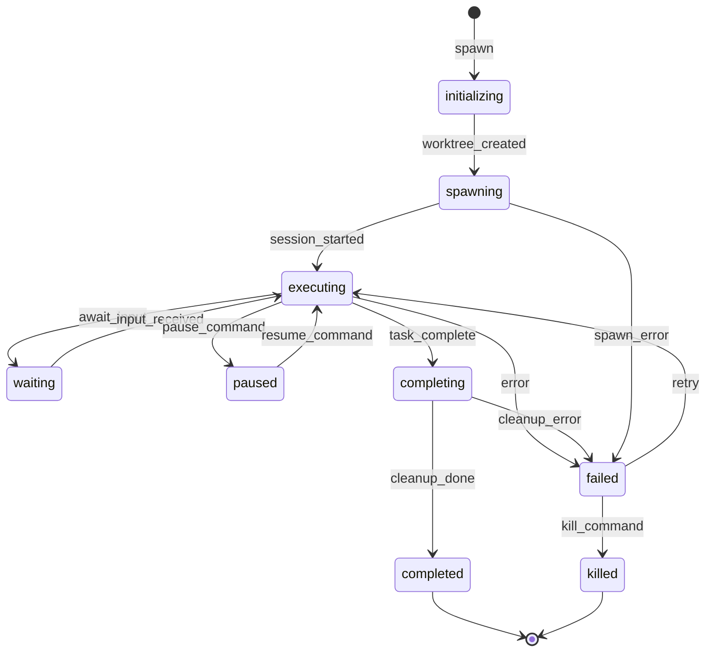
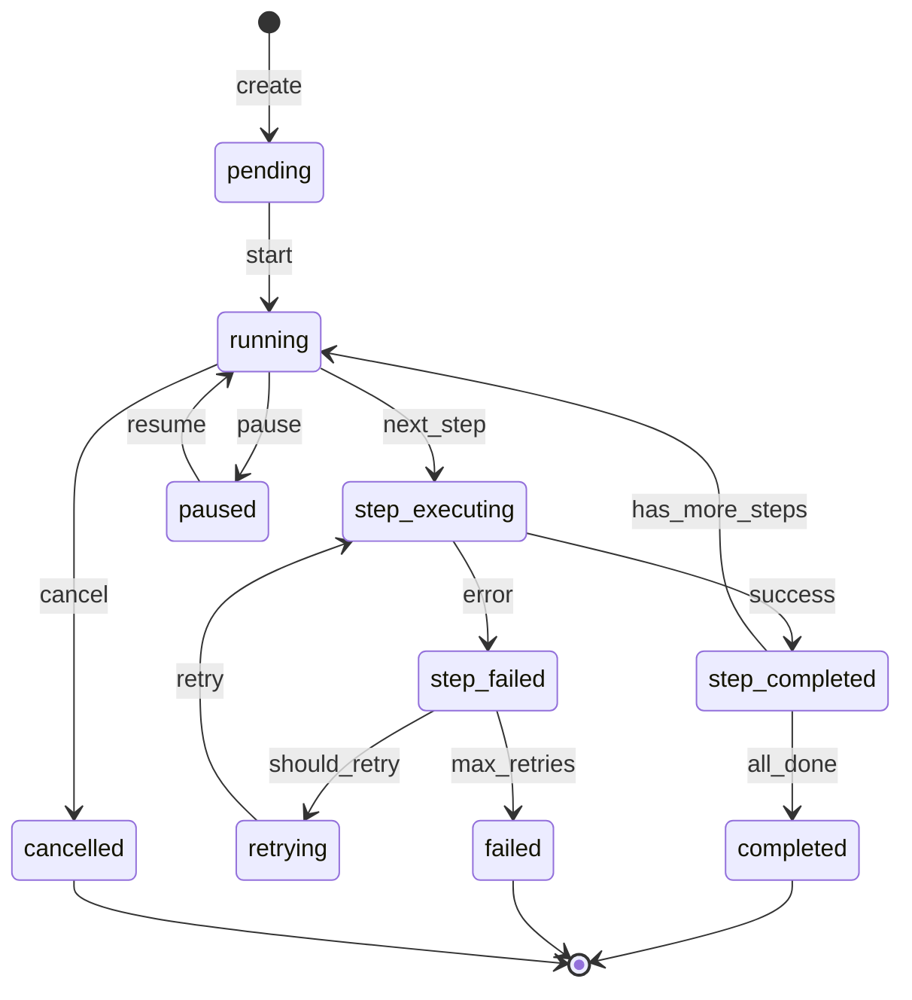
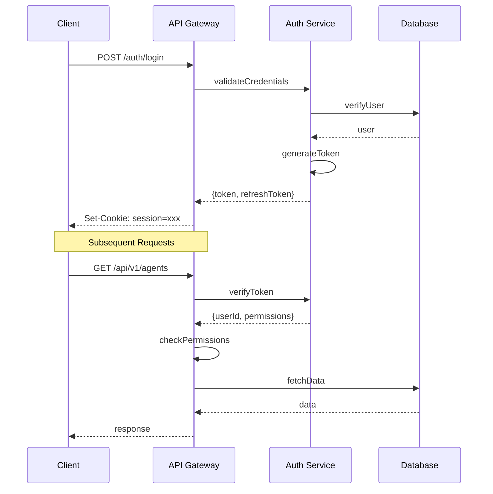
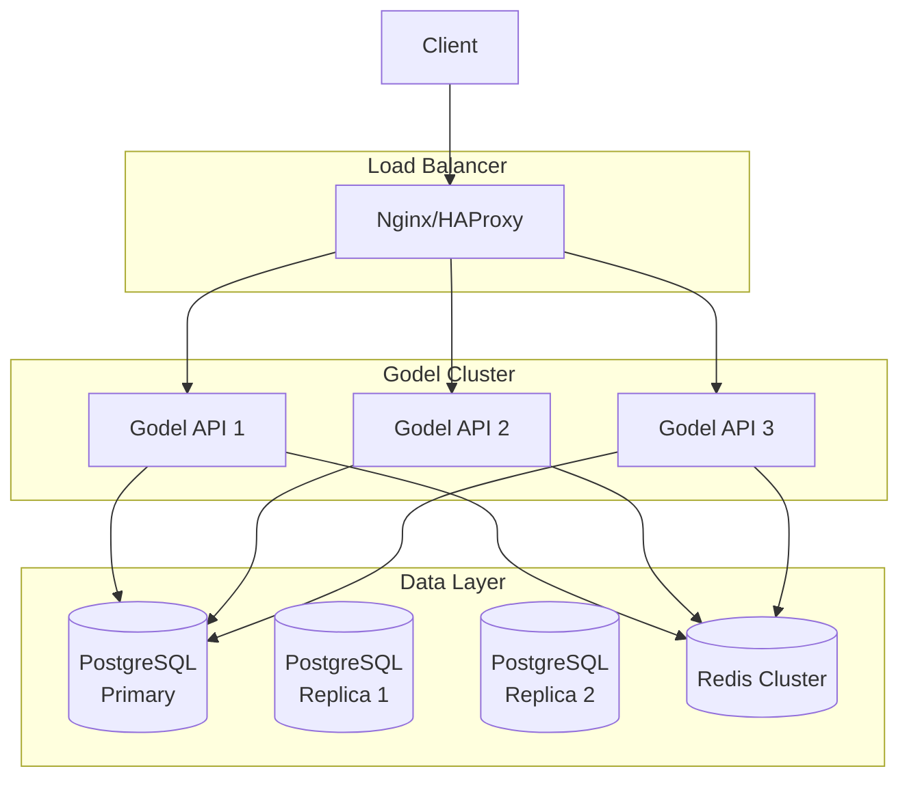

# Godel v2.0 Technical Specification

**Version:** 2.0.0  
**Status:** Draft  
**Date:** 2026-02-06  
**Author:** Technical Architecture Team  
**Target Release:** Q2 2026

---

## Table of Contents

1. [Architecture Overview](#1-architecture-overview)
2. [Data Models](#2-data-models)
3. [API Specifications](#3-api-specifications)
4. [Component Specifications](#4-component-specifications)
5. [Implementation Details](#5-implementation-details)
6. [Security Architecture](#6-security-architecture)
7. [Scalability Design](#7-scalability-design)
8. [Deployment Architecture](#8-deployment-architecture)
9. [Monitoring and Observability](#9-monitoring-and-observability)
10. [Testing Strategy](#10-testing-strategy)
11. [Migration Strategy](#11-migration-strategy)
12. [Open Questions and Risks](#12-open-questions-and-risks)

---

## 1. Architecture Overview

### 1.1 System Architecture

Godel v2.0 is a distributed, event-driven multi-agent orchestration platform designed to coordinate AI agents across multiple execution contexts while maintaining state, enforcing safety, and providing comprehensive observability.

#### High-Level Architecture Diagram



### 1.2 Component Overview

| Component | Purpose | Criticality |
|-----------|---------|-------------|
| TeamOrchestrator | Coordinates multi-agent teams, manages execution strategies | Critical |
| AgentRegistry | Maintains agent state, lifecycle, and metadata | Critical |
| EventBus | Pub/sub messaging for real-time coordination | Critical |
| StateMachine | Manages workflow and agent state transitions | Critical |
| WorkflowEngine | DAG-based workflow execution with dependency resolution | High |
| ClusterRegistry | Manages multi-cluster federation topology | High |
| MultiClusterLoadBalancer | Routes requests across clusters | High |
| TransparentProxy | Intercepts and proxies agent communication | Medium |
| MetricsCollector | Collects and aggregates system metrics | High |
| AlertManager | Monitors thresholds and triggers alerts | Medium |
| AutonomicOrchestrator | Self-healing and auto-scaling decisions | Medium |
| IntentParser | Parses natural language into structured intents | High |
| ComplexityAnalyzer | Analyzes task complexity for resource allocation | Medium |
| SwarmConfigGenerator | Generates optimal team configurations | Medium |

### 1.3 Data Flow Diagrams

#### Agent Spawn Flow



#### Event Propagation Flow



#### Workflow Execution Flow



### 1.4 Integration Points

| Integration | Protocol | Purpose |
|-------------|----------|---------|
| OpenClaw Gateway | WebSocket / RPC | Agent execution and notification |
| LLM Providers | HTTP/SSE | Model inference and streaming |
| PostgreSQL | TCP/SQL | Persistent state storage |
| Redis | TCP/RESP | Caching, pub/sub, queues |
| Kubernetes | HTTP/API | Remote agent execution |
| Git | CLI/libgit2 | Worktree management |

---

## 2. Data Models

### 2.1 Team/Agent/Session Entities

#### Team Entity

```typescript
interface Team {
  id: string;                    // UUID v4
  name: string;                  // Human-readable name
  description?: string;          // Optional description
  
  // Configuration
  config: TeamConfig;            // Execution strategy, limits
  executionStrategy: 'parallel' | 'map-reduce' | 'pipeline' | 'tree';
  
  // State
  status: TeamStatus;            // creating | active | paused | completed | failed
  agentIds: string[];            // Member agents
  
  // Budget
  budgetAllocated?: number;      // Maximum budget (USD)
  budgetConsumed: number;        // Current spend
  
  // Lifecycle
  createdAt: Date;
  updatedAt: Date;
  completedAt?: Date;
  
  // Metadata
  metadata: Record<string, unknown>;
}

type TeamStatus = 
  | 'creating' 
  | 'active' 
  | 'paused' 
  | 'completed' 
  | 'failed' 
  | 'archived';

interface TeamConfig {
  maxAgents: number;
  autoScale: boolean;
  resourceLimits: ResourceLimits;
  timeoutMinutes: number;
  retryPolicy: RetryPolicy;
}
```

#### Agent Entity

```typescript
interface Agent {
  id: string;                    // UUID v4
  teamId?: string;               // Parent team (optional)
  label?: string;                // Human-readable label
  
  // Configuration
  model: string;                 // LLM model identifier
  task: string;                  // Assigned task description
  config: AgentConfig;           // Runtime configuration
  
  // Context
  context?: AgentContext;        // Execution context
  code?: CodeState;              // Code artifacts
  reasoning?: ReasoningState;    // Reasoning traces
  safetyBoundaries?: SafetyRules;
  
  // State Machine
  status: AgentStatus;           // pending | running | paused | completed | failed
  lifecycleState: LifecycleState;
  
  // Worktree
  worktree?: string;             // Git worktree path
  commits: string[];             // Associated commits
  
  // Runtime Metrics
  spawnedAt: Date;
  completedAt?: Date;
  pauseTime?: Date;
  pausedBy?: string;
  runtime: number;               // Seconds of active execution
  
  // Resilience
  retryCount: number;
  maxRetries: number;
  lastError?: string;
  
  // Budget
  budgetLimit?: number;
  budgetConsumed?: number;
  
  // Metadata
  metadata: Record<string, unknown>;
}

type AgentStatus = 
  | 'pending' 
  | 'initializing'
  | 'running' 
  | 'paused' 
  | 'completed' 
  | 'failed' 
  | 'killed';

type LifecycleState =
  | 'initializing'
  | 'spawning'
  | 'executing'
  | 'waiting'
  | 'paused'
  | 'completing'
  | 'cleaning_up'
  | 'completed'
  | 'failed';

interface AgentConfig {
  temperature?: number;
  maxTokens?: number;
  tools?: string[];
  skills?: string[];
  extensions?: string[];
  sandbox?: SandboxConfig;
}
```

#### Session Entity

```typescript
interface Session {
  id: string;                    // UUID v4
  agentId: string;               // Parent agent
  parentId?: string;             // Parent session (for tree structure)
  
  // State
  status: SessionStatus;         // pending | active | completed | failed
  context: SessionContext;       // Session context/state
  
  // Tree Structure
  children: string[];            // Child session IDs
  depth: number;                 // Tree depth
  
  // Lifecycle
  createdAt: Date;
  updatedAt: Date;
  completedAt?: Date;
  
  // Metadata
  metadata: Record<string, unknown>;
}

type SessionStatus = 
  | 'pending' 
  | 'active' 
  | 'paused' 
  | 'completed' 
  | 'failed';

interface SessionContext {
  messages: Message[];
  variables: Record<string, unknown>;
  artifacts: Artifact[];
}
```

### 2.2 Event Model

```typescript
interface Event {
  id: string;                    // Unique event ID (UUID)
  type: EventType;               // Event type (namespaced)
  timestamp: number;             // Unix timestamp (ms)
  source: EventSource;           // Source component
  
  // Payload
  payload: Record<string, unknown>;
  
  // Correlation
  metadata: EventMetadata;
  
  // Persistence
  sequence?: number;             // Event sequence number
  partition?: string;            // Partition key
}

interface EventSource {
  component: string;             // Component name
  instance?: string;             // Instance identifier
  version?: string;              // Component version
}

interface EventMetadata {
  correlationId?: string;        // Request correlation ID
  causationId?: string;          // Causation event ID
  userId?: string;               // Originating user
  agentId?: string;              // Related agent
  teamId?: string;               // Related team
  workflowId?: string;           // Related workflow
  traceId?: string;              // Distributed trace ID
}

// Event Type Categories
type LifecycleEvent =
  | 'agent:start'
  | 'agent:complete'
  | 'agent:error'
  | 'agent:pause'
  | 'agent:resume'
  | 'agent:kill'
  | 'team:start'
  | 'team:complete'
  | 'team:scale';

type WorkflowEvent =
  | 'workflow:start'
  | 'workflow:step:start'
  | 'workflow:step:complete'
  | 'workflow:step:error'
  | 'workflow:complete'
  | 'workflow:cancel';

type SystemEvent =
  | 'system:health:warning'
  | 'system:health:critical'
  | 'budget:warning'
  | 'budget:exceeded'
  | 'safety:block'
  | 'scaling:up'
  | 'scaling:down';

type EventType = LifecycleEvent | WorkflowEvent | SystemEvent | string;
```

### 2.3 State Machine Definitions

#### Agent State Machine



#### Workflow State Machine



### 2.4 Database Schema

```sql
-- ============================================
-- Core Tables
-- ============================================

-- Teams (Swarms) Table
CREATE TABLE teams (
    id UUID PRIMARY KEY DEFAULT uuid_generate_v4(),
    name VARCHAR(255) NOT NULL,
    description TEXT,
    config JSONB NOT NULL DEFAULT '{}',
    execution_strategy VARCHAR(50) NOT NULL DEFAULT 'parallel',
    status VARCHAR(50) NOT NULL DEFAULT 'creating',
    
    -- Budget
    budget_allocated DECIMAL(12, 4),
    budget_consumed DECIMAL(12, 4) DEFAULT 0,
    
    -- Lifecycle
    created_at TIMESTAMP WITH TIME ZONE DEFAULT NOW(),
    updated_at TIMESTAMP WITH TIME ZONE DEFAULT NOW(),
    completed_at TIMESTAMP WITH TIME ZONE,
    
    -- Metadata
    metadata JSONB DEFAULT '{}'
);

-- Agents Table
CREATE TABLE agents (
    id UUID PRIMARY KEY DEFAULT uuid_generate_v4(),
    team_id UUID REFERENCES teams(id) ON DELETE SET NULL,
    
    -- Identity
    label VARCHAR(255),
    model VARCHAR(255) NOT NULL,
    
    -- Configuration
    task TEXT NOT NULL,
    config JSONB NOT NULL DEFAULT '{}',
    
    -- State
    status VARCHAR(50) NOT NULL DEFAULT 'pending',
    lifecycle_state VARCHAR(50) NOT NULL DEFAULT 'initializing',
    
    -- Context
    context JSONB,
    code JSONB,
    reasoning JSONB,
    safety_boundaries JSONB,
    
    -- Worktree
    worktree_path TEXT,
    commits JSONB DEFAULT '[]',
    
    -- Runtime
    spawned_at TIMESTAMP WITH TIME ZONE DEFAULT NOW(),
    completed_at TIMESTAMP WITH TIME ZONE,
    pause_time TIMESTAMP WITH TIME ZONE,
    paused_by VARCHAR(255),
    runtime_seconds INTEGER DEFAULT 0,
    
    -- Resilience
    retry_count INTEGER DEFAULT 0,
    max_retries INTEGER DEFAULT 3,
    last_error TEXT,
    
    -- Budget
    budget_limit DECIMAL(12, 4),
    budget_consumed DECIMAL(12, 4) DEFAULT 0,
    
    -- Metadata
    metadata JSONB DEFAULT '{}'
);

-- Sessions Table (Session Tree)
CREATE TABLE sessions (
    id UUID PRIMARY KEY DEFAULT uuid_generate_v4(),
    agent_id UUID NOT NULL REFERENCES agents(id) ON DELETE CASCADE,
    parent_id UUID REFERENCES sessions(id) ON DELETE CASCADE,
    
    status VARCHAR(50) NOT NULL DEFAULT 'pending',
    context JSONB NOT NULL DEFAULT '{}',
    
    -- Tree metadata
    depth INTEGER DEFAULT 0,
    
    created_at TIMESTAMP WITH TIME ZONE DEFAULT NOW(),
    updated_at TIMESTAMP WITH TIME ZONE DEFAULT NOW(),
    completed_at TIMESTAMP WITH TIME ZONE
);

-- Events Table (Event Store)
CREATE TABLE events (
    id UUID PRIMARY KEY DEFAULT uuid_generate_v4(),
    
    -- Event data
    event_type VARCHAR(100) NOT NULL,
    timestamp TIMESTAMP WITH TIME ZONE DEFAULT NOW(),
    payload JSONB NOT NULL,
    
    -- Source
    source_component VARCHAR(100),
    source_instance VARCHAR(100),
    source_version VARCHAR(50),
    
    -- Correlation
    correlation_id UUID,
    causation_id UUID,
    trace_id UUID,
    
    -- Relations
    agent_id UUID REFERENCES agents(id) ON DELETE CASCADE,
    team_id UUID REFERENCES teams(id) ON DELETE CASCADE,
    workflow_id UUID,
    user_id UUID,
    
    -- Persistence
    sequence_number BIGINT,
    partition_key VARCHAR(100)
);

-- Workflows Table
CREATE TABLE workflows (
    id UUID PRIMARY KEY DEFAULT uuid_generate_v4(),
    name VARCHAR(255) NOT NULL,
    description TEXT,
    
    -- Definition
    definition JSONB NOT NULL,  -- DAG definition
    
    -- State
    status VARCHAR(50) NOT NULL DEFAULT 'pending',
    current_step_id VARCHAR(100),
    
    -- Execution context
    context JSONB DEFAULT '{}',
    results JSONB DEFAULT '{}',
    
    -- Relations
    team_id UUID REFERENCES teams(id) ON DELETE SET NULL,
    created_by UUID,
    
    -- Lifecycle
    created_at TIMESTAMP WITH TIME ZONE DEFAULT NOW(),
    started_at TIMESTAMP WITH TIME ZONE,
    completed_at TIMESTAMP WITH TIME ZONE,
    
    -- Metadata
    metadata JSONB DEFAULT '{}'
);

-- Workflow Steps Table
CREATE TABLE workflow_steps (
    id UUID PRIMARY KEY DEFAULT uuid_generate_v4(),
    workflow_id UUID NOT NULL REFERENCES workflows(id) ON DELETE CASCADE,
    step_id VARCHAR(100) NOT NULL,
    
    -- Definition
    name VARCHAR(255) NOT NULL,
    task TEXT NOT NULL,
    dependencies JSONB DEFAULT '[]',
    
    -- State
    status VARCHAR(50) NOT NULL DEFAULT 'pending',
    result JSONB,
    error TEXT,
    
    -- Execution
    started_at TIMESTAMP WITH TIME ZONE,
    completed_at TIMESTAMP WITH TIME ZONE,
    retry_count INTEGER DEFAULT 0,
    
    -- Agent assignment
    agent_id UUID REFERENCES agents(id) ON DELETE SET NULL,
    
    UNIQUE(workflow_id, step_id)
);

-- Budgets Table
CREATE TABLE budgets (
    id UUID PRIMARY KEY DEFAULT uuid_generate_v4(),
    entity_type VARCHAR(50) NOT NULL,  -- 'agent', 'team', 'user', 'organization'
    entity_id UUID NOT NULL,
    
    total_budget DECIMAL(12, 4) NOT NULL,
    used_budget DECIMAL(12, 4) DEFAULT 0,
    currency VARCHAR(10) DEFAULT 'USD',
    
    period_start TIMESTAMP WITH TIME ZONE,
    period_end TIMESTAMP WITH TIME ZONE,
    
    created_at TIMESTAMP WITH TIME ZONE DEFAULT NOW(),
    updated_at TIMESTAMP WITH TIME ZONE DEFAULT NOW(),
    
    UNIQUE(entity_type, entity_id)
);

-- Clusters Table (Federation)
CREATE TABLE clusters (
    id UUID PRIMARY KEY DEFAULT uuid_generate_v4(),
    name VARCHAR(255) NOT NULL,
    region VARCHAR(100),
    
    -- Connection
    endpoint VARCHAR(500) NOT NULL,
    api_version VARCHAR(20),
    
    -- Health
    status VARCHAR(50) NOT NULL DEFAULT 'offline',
    last_heartbeat TIMESTAMP WITH TIME ZONE,
    health_score INTEGER DEFAULT 100,
    
    -- Capacity
    max_agents INTEGER,
    current_agents INTEGER DEFAULT 0,
    
    -- Metadata
    metadata JSONB DEFAULT '{}',
    
    created_at TIMESTAMP WITH TIME ZONE DEFAULT NOW(),
    updated_at TIMESTAMP WITH TIME ZONE DEFAULT NOW()
);

-- ============================================
-- Indexes
-- ============================================

-- Agent indexes
CREATE INDEX idx_agents_team_id ON agents(team_id);
CREATE INDEX idx_agents_status ON agents(status);
CREATE INDEX idx_agents_lifecycle_state ON agents(lifecycle_state);
CREATE INDEX idx_agents_status_spawned ON agents(status, spawned_at DESC);
CREATE INDEX idx_agents_model ON agents(model);

-- Team indexes
CREATE INDEX idx_teams_status ON teams(status);
CREATE INDEX idx_teams_created_at ON teams(created_at DESC);

-- Event indexes
CREATE INDEX idx_events_type ON events(event_type);
CREATE INDEX idx_events_timestamp ON events(timestamp DESC);
CREATE INDEX idx_events_correlation_id ON events(correlation_id);
CREATE INDEX idx_events_agent_id ON events(agent_id);
CREATE INDEX idx_events_team_id ON events(team_id);
CREATE INDEX idx_events_trace_id ON events(trace_id);

-- Session indexes
CREATE INDEX idx_sessions_agent_id ON sessions(agent_id);
CREATE INDEX idx_sessions_parent_id ON sessions(parent_id);
CREATE INDEX idx_sessions_status ON sessions(status);

-- Workflow indexes
CREATE INDEX idx_workflows_status ON workflows(status);
CREATE INDEX idx_workflows_team_id ON workflows(team_id);
CREATE INDEX idx_workflow_steps_workflow_id ON workflow_steps(workflow_id);

-- Cluster indexes
CREATE INDEX idx_clusters_status ON clusters(status);
CREATE INDEX idx_clusters_region ON clusters(region);

-- ============================================
-- Partitioning (for events table at scale)
-- ============================================

-- For high-volume event tables, use time-based partitioning
-- CREATE TABLE events_partitioned (
--     LIKE events INCLUDING ALL
-- ) PARTITION BY RANGE (timestamp);

-- Create monthly partitions
-- CREATE TABLE events_y2026m01 PARTITION OF events_partitioned
--     FOR VALUES FROM ('2026-01-01') TO ('2026-02-01');
```

---

## 3. API Specifications

### 3.1 REST API Endpoints

#### Base URL and Versioning

```
Base URL: /api/v1
Compatibility: /api (aliases to /api/v1)
Content-Type: application/json
```

#### Authentication

All endpoints (except health and capabilities) require authentication via:
- **API Key**: Header `X-API-Key: <key>`
- **Bearer Token**: Header `Authorization: Bearer <token>`
- **Cookie Session**: Session cookie from `/auth/login`

#### Endpoint Summary

| Method | Endpoint | Description | Auth |
|--------|----------|-------------|------|
| GET | `/health` | Health check | No |
| GET | `/health/detailed` | Detailed health | Yes |
| GET | `/health/ready` | Readiness probe | No |
| GET | `/health/live` | Liveness probe | No |
| GET | `/capabilities` | API capabilities | No |
| GET | `/openapi.json` | OpenAPI spec | No |

##### Agents

| Method | Endpoint | Description |
|--------|----------|-------------|
| GET | `/agents` | List agents (paginated) |
| POST | `/agents` | Create agent |
| GET | `/agents/{id}` | Get agent details |
| DELETE | `/agents/{id}` | Delete agent |
| POST | `/agents/{id}/kill` | Kill agent |
| POST | `/agents/{id}/restart` | Restart agent |
| POST | `/agents/{id}/pause` | Pause agent |
| POST | `/agents/{id}/resume` | Resume agent |
| GET | `/agents/{id}/logs` | Get agent logs |
| GET | `/agents/{id}/events` | Get agent events |

##### Teams (Swarms)

| Method | Endpoint | Description |
|--------|----------|-------------|
| GET | `/teams` | List teams |
| POST | `/teams` | Create team |
| GET | `/teams/{id}` | Get team details |
| PATCH | `/teams/{id}` | Update team |
| DELETE | `/teams/{id}` | Delete team |
| POST | `/teams/{id}/start` | Start team execution |
| POST | `/teams/{id}/pause` | Pause team |
| POST | `/teams/{id}/resume` | Resume team |
| POST | `/teams/{id}/scale` | Scale team agents |
| GET | `/teams/{id}/agents` | List team agents |
| GET | `/teams/{id}/metrics` | Get team metrics |

##### Workflows

| Method | Endpoint | Description |
|--------|----------|-------------|
| GET | `/workflows` | List workflows |
| POST | `/workflows` | Create workflow |
| GET | `/workflows/{id}` | Get workflow |
| PATCH | `/workflows/{id}` | Update workflow |
| DELETE | `/workflows/{id}` | Delete workflow |
| POST | `/workflows/{id}/start` | Start workflow |
| POST | `/workflows/{id}/cancel` | Cancel workflow |
| GET | `/workflows/{id}/steps` | List workflow steps |

##### Events

| Method | Endpoint | Description |
|--------|----------|-------------|
| GET | `/events` | Query events |
| POST | `/events` | Publish event |
| GET | `/events/{id}` | Get event |
| GET | `/events/stream` | SSE event stream |

##### Tasks

| Method | Endpoint | Description |
|--------|----------|-------------|
| GET | `/tasks` | List tasks |
| POST | `/tasks` | Create task |
| GET | `/tasks/{id}` | Get task |
| POST | `/tasks/{id}/assign` | Assign to agent |
| POST | `/tasks/{id}/complete` | Complete task |

##### Metrics

| Method | Endpoint | Description |
|--------|----------|-------------|
| GET | `/metrics` | Prometheus metrics |
| GET | `/metrics/agents` | Agent metrics |
| GET | `/metrics/teams` | Team metrics |
| GET | `/metrics/system` | System metrics |

#### Request/Response Examples

##### Create Agent

**Request:**
```http
POST /api/v1/agents
Content-Type: application/json
X-API-Key: godel_sk_xxx

{
  "label": "worker-1",
  "model": "kimi-k2.5",
  "task": "Implement user authentication",
  "teamId": "550e8400-e29b-41d4-a716-446655440000",
  "maxRetries": 3,
  "budgetLimit": 10.00,
  "config": {
    "temperature": 0.7,
    "tools": ["git", "file", "bash"],
    "skills": ["typescript", "testing"]
  }
}
```

**Response (201):**
```json
{
  "success": true,
  "data": {
    "id": "550e8400-e29b-41d4-a716-446655440001",
    "label": "worker-1",
    "model": "kimi-k2.5",
    "status": "pending",
    "lifecycleState": "initializing",
    "task": "Implement user authentication",
    "teamId": "550e8400-e29b-41d4-a716-446655440000",
    "spawnedAt": "2026-02-06T12:00:00Z",
    "metadata": {
      "worktree": "/tmp/godel/worktrees/agent-550e8400"
    }
  }
}
```

##### List Agents

**Request:**
```http
GET /api/v1/agents?status=running&limit=10
X-API-Key: godel_sk_xxx
```

**Response (200):**
```json
{
  "success": true,
  "data": {
    "items": [
      {
        "id": "550e8400-e29b-41d4-a716-446655440001",
        "label": "worker-1",
        "status": "running",
        "model": "kimi-k2.5",
        "teamId": "550e8400-e29b-41d4-a716-446655440000",
        "runtime": 120
      }
    ],
    "pagination": {
      "limit": 10,
      "cursor": "eyJpZCI6IjU1MGU4NDAwLWUyOWItNDFkNC1hNzE2LTQ0NjY1NTQ0MDAwMSJ9",
      "hasMore": true
    }
  }
}
```

### 3.2 WebSocket Protocol

#### Connection

```
Endpoint: ws://host:port/events
Protocol: godel-events-v1
Authentication: Query param ?token=<jwt> or cookie
```

#### Message Format

```typescript
interface WebSocketMessage {
  id: string;                    // Message ID
  type: MessageType;             // Message type
  timestamp: number;             // Unix timestamp
  payload: unknown;              // Message payload
  metadata?: MessageMetadata;
}

type MessageType = 
  | 'event'                      // Event notification
  | 'command'                    // Command request
  | 'response'                   // Command response
  | 'subscribe'                  // Subscription request
  | 'unsubscribe'                // Unsubscribe request
  | 'ping'                       // Keepalive ping
  | 'pong'                       // Keepalive pong
  | 'error';                     // Error notification
```

#### Client → Server Messages

**Subscribe to events:**
```json
{
  "id": "msg-1",
  "type": "subscribe",
  "timestamp": 1707225600000,
  "payload": {
    "patterns": ["agent:*", "team:complete"],
    "filters": {
      "teamId": "550e8400-e29b-41d4-a716-446655440000"
    }
  }
}
```

**Command:**
```json
{
  "id": "msg-2",
  "type": "command",
  "timestamp": 1707225600000,
  "payload": {
    "command": "agent:pause",
    "agentId": "550e8400-e29b-41d4-a716-446655440001"
  }
}
```

**Ping:**
```json
{
  "id": "ping-1",
  "type": "ping",
  "timestamp": 1707225600000,
  "payload": {}
}
```

#### Server → Client Messages

**Event:**
```json
{
  "id": "evt-1",
  "type": "event",
  "timestamp": 1707225600000,
  "payload": {
    "id": "550e8400-e29b-41d4-a716-446655440100",
    "type": "agent:complete",
    "data": {
      "agentId": "550e8400-e29b-41d4-a716-446655440001",
      "duration": 120,
      "cost": 0.05
    }
  }
}
```

**Response:**
```json
{
  "id": "msg-2",
  "type": "response",
  "timestamp": 1707225600100,
  "payload": {
    "success": true,
    "data": {
      "agentId": "550e8400-e29b-41d4-a716-446655440001",
      "status": "paused"
    }
  },
  "metadata": {
    "correlationId": "msg-2"
  }
}
```

#### Reconnection Strategy

1. **Automatic reconnection** with exponential backoff
2. **Resume from last sequence number** for event replay
3. **Connection state tracking** in client

```typescript
interface ReconnectionConfig {
  maxRetries: number;            // Max reconnection attempts
  initialDelayMs: number;        // Initial retry delay
  maxDelayMs: number;            // Max retry delay
  backoffMultiplier: number;     // Exponential backoff factor
}

const defaultReconnectionConfig: ReconnectionConfig = {
  maxRetries: 10,
  initialDelayMs: 1000,
  maxDelayMs: 30000,
  backoffMultiplier: 2
};
```

### 3.3 gRPC Services

For high-performance internal communication, Godel exposes gRPC services:

```protobuf
syntax = "proto3";
package godel.v1;

// Agent Service
service AgentService {
  rpc SpawnAgent(SpawnAgentRequest) returns (SpawnAgentResponse);
  rpc GetAgent(GetAgentRequest) returns (Agent);
  rpc KillAgent(KillAgentRequest) returns (KillAgentResponse);
  rpc StreamAgentLogs(StreamAgentLogsRequest) returns (stream LogEntry);
}

// Team Service
service TeamService {
  rpc CreateTeam(CreateTeamRequest) returns (Team);
  rpc StartTeam(StartTeamRequest) returns (stream TeamEvent);
  rpc ScaleTeam(ScaleTeamRequest) returns (ScaleTeamResponse);
}

// Event Service
service EventService {
  rpc PublishEvent(PublishEventRequest) returns (PublishEventResponse);
  rpc SubscribeEvents(SubscribeEventsRequest) returns (stream Event);
}

// Cluster Federation Service
service ClusterService {
  rpc RegisterCluster(RegisterClusterRequest) returns (Cluster);
  rpc Heartbeat(HeartbeatRequest) returns (HeartbeatResponse);
  rpc RouteRequest(RouteRequestRequest) returns (RouteRequestResponse);
}
```

### 3.4 Authentication and Authorization

#### Authentication Flow



#### Authorization Model

**RBAC (Role-Based Access Control):**

```typescript
interface Role {
  id: string;
  name: string;
  permissions: Permission[];
}

interface Permission {
  resource: string;              // 'agent', 'team', 'workflow'
  action: string;                // 'create', 'read', 'update', 'delete'
  scope?: string;                // 'own', 'team', 'organization', 'all'
}

// Default Roles
const DEFAULT_ROLES = {
  admin: ['*:*:all'],            // Full access
  operator: [
    'agent:*:team',
    'team:*:team',
    'workflow:*:team',
    'event:read:team'
  ],
  developer: [
    'agent:*:own',
    'team:read:team',
    'workflow:*:own',
    'event:read:team'
  ],
  viewer: [
    'agent:read:team',
    'team:read:team',
    'event:read:team'
  ]
};
```

---

## 4. Component Specifications

### 4.1 Core Components

#### TeamOrchestrator

**Purpose:** Coordinates multi-agent teams, manages execution strategies, and optimizes resource allocation.

**Responsibilities:**
- Team lifecycle management (create, start, pause, resume, complete)
- Execution strategy implementation (parallel, map-reduce, pipeline, tree)
- Agent coordination and communication facilitation
- Resource allocation and load balancing within team
- Fault tolerance and recovery at team level

**Interface:**

```typescript
interface TeamOrchestrator {
  // Lifecycle
  createTeam(config: TeamConfig): Promise<Team>;
  startTeam(teamId: string): Promise<void>;
  pauseTeam(teamId: string): Promise<void>;
  resumeTeam(teamId: string): Promise<void>;
  completeTeam(teamId: string): Promise<void>;
  
  // Agent Management
  addAgent(teamId: string, agentConfig: AgentConfig): Promise<Agent>;
  removeAgent(teamId: string, agentId: string): Promise<void>;
  
  // Execution
  executeStrategy(teamId: string, strategy: ExecutionStrategy): Promise<ExecutionResult>;
  
  // Scaling
  scaleTeam(teamId: string, targetSize: number): Promise<ScaleResult>;
}
```

**Execution Strategies:**

| Strategy | Description | Use Case |
|----------|-------------|----------|
| `parallel` | All agents work independently | Code review, analysis |
| `map-reduce` | Split work, aggregate results | Data processing |
| `pipeline` | Sequential agent stages | CI/CD, build pipelines |
| `tree` | Hierarchical task decomposition | Complex problem solving |

**State Management:**
```typescript
interface TeamState {
  status: TeamStatus;
  agents: Map<string, AgentState>;
  progress: number;              // 0-100
  results: Map<string, unknown>;
  errors: Error[];
}
```

**Failure Modes:**
- Agent failure → Retry or replace agent
- Strategy failure → Fallback to simpler strategy
- Resource exhaustion → Queue tasks, alert operators

---

#### AgentRegistry

**Purpose:** Central registry for agent lifecycle, state management, and discovery.

**Responsibilities:**
- Agent registration and deregistration
- State tracking and transitions
- Agent discovery and querying
- Lifecycle event publishing
- Metadata management

**Interface:**

```typescript
interface AgentRegistry {
  // Registration
  register(config: AgentConfig): Promise<Agent>;
  unregister(agentId: string): Promise<void>;
  
  // State Management
  updateState(agentId: string, state: Partial<AgentState>): Promise<void>;
  getState(agentId: string): Promise<AgentState>;
  
  // Queries
  find(query: AgentQuery): Promise<Agent[]>;
  getById(agentId: string): Promise<Agent | null>;
  getByTeam(teamId: string): Promise<Agent[]>;
  
  // Lifecycle
  transition(agentId: string, toState: LifecycleState): Promise<void>;
}

interface AgentQuery {
  status?: AgentStatus | AgentStatus[];
  teamId?: string;
  model?: string;
  labels?: string[];
  createdAfter?: Date;
  createdBefore?: Date;
}
```

**State Transitions:**
```
initializing → spawning → executing → completing → completed
     ↓              ↓           ↓           ↓
   failed        failed      paused      failed
                            ↓    ↓
                         failed completed
```

**Performance Characteristics:**
- Registration: < 10ms
- State update: < 5ms
- Query by index: < 20ms for 10k agents

---

#### EventBus

**Purpose:** Pub/sub messaging system for real-time coordination and event-driven architecture.

**Responsibilities:**
- Event publishing and subscription
- Pattern-based routing
- Event persistence and replay
- Subscription lifecycle management
- Backpressure handling

**Interface:**

```typescript
interface EventBus {
  // Publishing
  publish(event: Event): Promise<void>;
  publishBatch(events: Event[]): Promise<void>;
  
  // Subscription
  subscribe(
    pattern: string | string[],
    handler: EventHandler,
    options?: SubscribeOptions
  ): Promise<Subscription>;
  
  subscribeOnce(pattern: string, handler: EventHandler): Promise<Subscription>;
  
  // Pattern subscription
  onPattern(pattern: string, handler: EventHandler): Subscription;
  
  // Replay
  replay(options: ReplayOptions): AsyncIterable<Event>;
  
  // Management
  getSubscriptions(): Subscription[];
  getStats(): EventBusStats;
}

type EventHandler = (event: Event) => void | Promise<void>;

interface SubscribeOptions {
  persistent?: boolean;          // Persist subscription across restarts
  replay?: boolean;              // Replay missed events on reconnect
  filter?: EventFilter;          // Event filter predicate
  bufferSize?: number;           // Max buffered events
}
```

**Event Patterns:**

```typescript
// Wildcard patterns
eventBus.onPattern('agent:*', handler);        // All agent events
eventBus.onPattern('agent:start', handler);    // Specific event
eventBus.onPattern('workflow:step:*', handler); // All step events

// Multiple patterns
eventBus.subscribe(['agent:complete', 'agent:error'], handler);
```

**Backpressure Strategies:**

| Strategy | Behavior | Use Case |
|----------|----------|----------|
| `drop` | Drop new events when buffer full | Metrics, non-critical |
| `block` | Block publisher until space available | Critical events |
| `sliding` | Drop oldest events | Real-time streams |

---

#### StateMachine

**Purpose:** Manages workflow and agent state transitions with validation and side effects.

**Responsibilities:**
- State transition validation
- Transition side effect execution
- State persistence
- Transition history tracking
- Concurrent transition handling

**Interface:**

```typescript
interface StateMachine<S extends string, E extends string> {
  // Configuration
  define(config: StateMachineConfig<S, E>): void;
  
  // Transitions
  transition(
    entityId: string,
    event: E,
    context?: TransitionContext
  ): Promise<TransitionResult<S>>;
  
  // Queries
  getState(entityId: string): Promise<S>;
  canTransition(entityId: string, event: E): Promise<boolean>;
  getHistory(entityId: string): Promise<TransitionRecord<S, E>[]>;
  
  // Management
  registerSideEffect(
    from: S,
    to: S,
    effect: SideEffect<S>
  ): void;
}

interface StateMachineConfig<S extends string, E extends string> {
  initial: S;
  states: Record<S, StateConfig<S, E>>;
}

interface StateConfig<S extends string, E extends string> {
  on?: Partial<Record<E, S>>;    // Event → Next state
  entry?: SideEffect<S>;         // On enter
  exit?: SideEffect<S>;          // On exit
}

type SideEffect<S> = (
  from: S,
  to: S,
  context: TransitionContext
) => Promise<void>;
```

**Example Configuration (Agent):**

```typescript
const agentStateMachine = createStateMachine({
  initial: 'initializing',
  states: {
    initializing: {
      on: { WORKTREE_CREATED: 'spawning' }
    },
    spawning: {
      on: { SESSION_STARTED: 'executing', SPAWN_ERROR: 'failed' },
      entry: async () => { /* setup */ }
    },
    executing: {
      on: { 
        TASK_COMPLETE: 'completing',
        PAUSE: 'paused',
        ERROR: 'failed'
      }
    },
    paused: {
      on: { RESUME: 'executing', KILL: 'killed' }
    },
    completing: {
      on: { CLEANUP_DONE: 'completed', CLEANUP_ERROR: 'failed' }
    },
    completed: { /* terminal */ },
    failed: {
      on: { RETRY: 'executing', KILL: 'killed' }
    },
    killed: { /* terminal */ }
  }
});
```

---

#### WorkflowEngine

**Purpose:** DAG-based workflow execution with dependency resolution, parallel execution, and error handling.

**Responsibilities:**
- Workflow definition parsing
- DAG validation and building
- Topological sorting
- Step execution with dependency resolution
- Parallel execution optimization
- Retry and error handling

**Interface:**

```typescript
interface WorkflowEngine {
  // Definition
  parse(definition: WorkflowDefinition): ParsedWorkflow;
  validate(workflow: ParsedWorkflow): ValidationResult;
  
  // Execution
  execute(
    workflowId: string,
    context?: WorkflowContext
  ): Promise<WorkflowResult>;
  
  executeStep(
    workflowId: string,
    stepId: string,
    context?: StepContext
  ): Promise<StepResult>;
  
  // Control
  pause(workflowId: string): Promise<void>;
  resume(workflowId: string): Promise<void>;
  cancel(workflowId: string): Promise<void>;
  
  // Queries
  getStatus(workflowId: string): Promise<WorkflowStatus>;
  getProgress(workflowId: string): Promise<number>;
}
```

**Workflow Definition:**

```typescript
interface WorkflowDefinition {
  name: string;
  description?: string;
  
  steps: StepDefinition[];
  
  // Execution config
  timeout?: number;              // Total timeout (seconds)
  maxConcurrency?: number;       // Max parallel steps
  
  // Error handling
  onError?: 'fail' | 'continue' | 'retry';
  retryPolicy?: RetryPolicy;
}

interface StepDefinition {
  id: string;
  name: string;
  task: string;                  // Task description or template
  
  // Dependencies
  dependsOn?: string[];          // Step IDs that must complete first
  
  // Configuration
  timeout?: number;
  retries?: number;
  
  // Conditional execution
  when?: string;                 // Condition expression
  
  // Agent assignment
  agent?: string;                // Specific agent ID
  agentSelector?: AgentSelector; // Dynamic selection
}
```

**DAG Execution Algorithm:**

```typescript
async function executeDAG(workflow: ParsedWorkflow): Promise<void> {
  const completed = new Set<string>();
  const inProgress = new Set<string>();
  
  while (completed.size < workflow.steps.length) {
    // Find ready steps (all deps satisfied)
    const ready = workflow.steps.filter(step => 
      !completed.has(step.id) &&
      !inProgress.has(step.id) &&
      step.dependsOn.every(dep => completed.has(dep))
    );
    
    // Respect max concurrency
    const toStart = ready.slice(0, maxConcurrency - inProgress.size);
    
    // Start ready steps
    for (const step of toStart) {
      inProgress.add(step.id);
      executeStep(step).then(result => {
        inProgress.delete(step.id);
        completed.add(step.id);
        // Persist result
      });
    }
    
    // Wait for at least one to complete
    await waitForCompletion(inProgress);
  }
}
```

---

### 4.2 Federation Components

#### ClusterRegistry

**Purpose:** Manages federation topology, cluster discovery, and health tracking for multi-cluster deployments.

**Responsibilities:**
- Cluster registration and deregistration
- Health monitoring and scoring
- Topology management
- Service discovery across clusters
- Failover coordination

**Interface:**

```typescript
interface ClusterRegistry {
  // Registration
  register(cluster: ClusterConfig): Promise<Cluster>;
  unregister(clusterId: string): Promise<void>;
  
  // Health
  updateHealth(clusterId: string, health: HealthStatus): Promise<void>;
  heartbeat(clusterId: string): Promise<void>;
  
  // Discovery
  getClusters(filter?: ClusterFilter): Promise<Cluster[]>;
  getHealthyClusters(): Promise<Cluster[]>;
  getClusterById(id: string): Promise<Cluster | null>;
  getClusterForRegion(region: string): Promise<Cluster | null>;
  
  // Routing
  getOptimalCluster(request: RoutingRequest): Promise<Cluster>;
}

interface Cluster {
  id: string;
  name: string;
  region: string;
  endpoint: string;
  
  // Health
  status: ClusterStatus;
  healthScore: number;           // 0-100
  lastHeartbeat: Date;
  
  // Capacity
  maxAgents: number;
  currentAgents: number;
  loadFactor: number;            // 0-1
  
  // Capabilities
  features: string[];
  supportedModels: string[];
}
```

**Health Scoring:**

```typescript
interface HealthFactors {
  connectivity: number;          // Connection success rate
  latency: number;               // Response time
  errorRate: number;             // Error percentage
  capacity: number;              // Available capacity
  freshness: number;             // Heartbeat recency
}

function calculateHealthScore(factors: HealthFactors): number {
  return (
    factors.connectivity * 0.25 +
    (1 - factors.latency / MAX_LATENCY) * 0.20 +
    (1 - factors.errorRate) * 0.25 +
    factors.capacity * 0.20 +
    factors.freshness * 0.10
  ) * 100;
}
```

---

#### MultiClusterLoadBalancer

**Purpose:** Routes requests across clusters based on health, capacity, and affinity policies.

**Responsibilities:**
- Request routing to optimal cluster
- Session affinity maintenance
- Load distribution optimization
- Failover handling
- Circuit breaker integration

**Interface:**

```typescript
interface MultiClusterLoadBalancer {
  // Configuration
  setStrategy(strategy: LoadBalanceStrategy): void;
  
  // Routing
  route(request: RoutingRequest): Promise<RoutingResult>;
  
  // Affinity
  getAffinity(sessionId: string): string | null;  // clusterId
  setAffinity(sessionId: string, clusterId: string): void;
  clearAffinity(sessionId: string): void;
  
  // Statistics
  getStats(): LoadBalancerStats;
}

type LoadBalanceStrategy =
  | 'round-robin'
  | 'least-connections'
  | 'weighted-response-time'
  | 'health-score'
  | 'geographic';

interface RoutingRequest {
  sessionId?: string;            // For affinity
  region?: string;               // Preferred region
  requirements?: {
    minCapacity?: number;
    features?: string[];
    models?: string[];
  };
}
```

**Routing Algorithm (Health Score Strategy):**

```typescript
function selectCluster(
  clusters: Cluster[],
  request: RoutingRequest
): Cluster {
  // Filter by requirements
  const eligible = clusters.filter(c => 
    meetsRequirements(c, request.requirements)
  );
  
  // Check affinity
  if (request.sessionId) {
    const affinityCluster = getAffinity(request.sessionId);
    if (affinityCluster && eligible.includes(affinityCluster)) {
      return affinityCluster;
    }
  }
  
  // Weighted random selection by health score
  const totalWeight = eligible.reduce((sum, c) => sum + c.healthScore, 0);
  let random = Math.random() * totalWeight;
  
  for (const cluster of eligible) {
    random -= cluster.healthScore;
    if (random <= 0) return cluster;
  }
  
  return eligible[0];
}
```

---

#### TransparentProxy

**Purpose:** Intercepts and proxies agent communication for monitoring, transformation, and policy enforcement.

**Responsibilities:**
- Request/response interception
- Protocol translation
- Policy enforcement
- Logging and auditing
- Rate limiting

**Interface:**

```typescript
interface TransparentProxy {
  // Configuration
  configure(config: ProxyConfig): void;
  
  // Interception
  intercept(request: ProxyRequest): Promise<ProxyResponse>;
  
  // Policies
  addPolicy(policy: ProxyPolicy): void;
  removePolicy(policyId: string): void;
  
  // Monitoring
  getMetrics(): ProxyMetrics;
}

interface ProxyRequest {
  id: string;
  source: string;                // Agent or service ID
  target: string;                // Target service/endpoint
  payload: unknown;
  headers: Record<string, string>;
}

interface ProxyPolicy {
  id: string;
  type: 'rate-limit' | 'transform' | 'block' | 'log';
  condition: PolicyCondition;
  action: PolicyAction;
}
```

---

### 4.3 Loop Components

#### MetricsCollector

**Purpose:** Collects, aggregates, and exposes system metrics for observability and autonomic decisions.

**Responsibilities:**
- Metric collection from all components
- Aggregation and rollups
- Prometheus/OpenTelemetry export
- Custom metric registration
- Metric retention management

**Interface:**

```typescript
interface MetricsCollector {
  // Registration
  registerCounter(name: string, labels?: string[]): Counter;
  registerGauge(name: string, labels?: string[]): Gauge;
  registerHistogram(name: string, buckets?: number[]): Histogram;
  
  // Collection
  collect(): Promise<MetricSnapshot>;
  
  // Export
  exportPrometheus(): string;
  exportOpenTelemetry(): OTLPMetrics;
  
  // Queries
  query(query: MetricQuery): Promise<MetricResult>;
}

// Key Metrics
const METRICS = {
  // Agent metrics
  'godel_agents_total': 'Total agents created',
  'godel_agents_active': 'Currently active agents',
  'godel_agent_duration_seconds': 'Agent execution duration',
  'godel_agent_cost_dollars': 'Agent execution cost',
  
  // Team metrics
  'godel_teams_total': 'Total teams created',
  'godel_team_agents': 'Agents per team',
  'godel_team_completion_rate': 'Team completion rate',
  
  // System metrics
  'godel_api_requests_total': 'API request count',
  'godel_api_request_duration_seconds': 'API request latency',
  'godel_events_total': 'Event count',
  'godel_queue_depth': 'Task queue depth',
  
  // Federation metrics
  'godel_cluster_health_score': 'Cluster health score',
  'godel_cluster_agents': 'Agents per cluster',
  'godel_federation_requests_total': 'Cross-cluster requests'
};
```

---

#### AlertManager

**Purpose:** Monitors metrics against thresholds and triggers alerts through multiple channels.

**Responsibilities:**
- Alert rule evaluation
- Alert routing and grouping
- Notification dispatch
- Alert suppression and silencing
- Alert history

**Interface:**

```typescript
interface AlertManager {
  // Rules
  addRule(rule: AlertRule): void;
  removeRule(ruleId: string): void;
  
  // Evaluation
  evaluate(): Promise<Alert[]>;
  
  // Routing
  route(alert: Alert): Promise<Notification[]>;
  
  // Channels
  addChannel(channel: NotificationChannel): void;
}

interface AlertRule {
  id: string;
  name: string;
  condition: AlertCondition;
  severity: 'info' | 'warning' | 'critical';
  
  // Routing
  channels: string[];
  
  // Timing
  for: number;                   // Duration before firing (seconds)
  interval: number;              // Evaluation interval (seconds)
  
  // Suppression
  silence?: SilenceConfig;
}

interface AlertCondition {
  metric: string;
  operator: 'gt' | 'lt' | 'eq' | 'ne';
  threshold: number;
  labels?: Record<string, string>;
}
```

**Default Alert Rules:**

```yaml
rules:
  - name: HighAgentFailureRate
    condition:
      metric: godel_agent_failure_rate_5m
      operator: gt
      threshold: 0.1
    severity: warning
    for: 300
    
  - name: QueueBacklog
    condition:
      metric: godel_queue_depth
      operator: gt
      threshold: 1000
    severity: critical
    for: 60
    
  - name: ClusterUnhealthy
    condition:
      metric: godel_cluster_health_score
      operator: lt
      threshold: 50
    severity: critical
    for: 120
```

---

#### AutonomicOrchestrator

**Purpose:** Self-healing and auto-scaling orchestration based on system metrics and health.

**Responsibilities:**
- Automatic scaling decisions
- Self-healing actions
- Resource optimization
- Anomaly detection
- Remediation execution

**Interface:**

```typescript
interface AutonomicOrchestrator {
  // Policies
  addPolicy(policy: AutonomicPolicy): void;
  
  // Actions
  execute(action: AutonomicAction): Promise<ActionResult>;
  
  // Queries
  getRecommendations(): Promise<Recommendation[]>;
}

interface AutonomicPolicy {
  id: string;
  trigger: PolicyTrigger;
  action: AutonomicAction;
  cooldown: number;              // Seconds between executions
}

type PolicyTrigger =
  | { type: 'metric'; metric: string; threshold: number; operator: 'gt' | 'lt' }
  | { type: 'alert'; alertId: string }
  | { type: 'schedule'; cron: string };

type AutonomicAction =
  | { type: 'scale-up'; target: string; delta: number }
  | { type: 'scale-down'; target: string; delta: number }
  | { type: 'restart'; target: string }
  | { type: 'rebalance' }
  | { type: 'notify'; channel: string; message: string };
```

**Self-Healing Actions:**

| Trigger | Action | Description |
|---------|--------|-------------|
| Agent stuck > 5 min | Restart agent | Kill and respawn |
| Queue depth > 1000 | Scale up | Add processing agents |
| Cluster health < 50% | Failover | Route to healthy cluster |
| Memory usage > 90% | Rebalance | Redistribute agents |

---

### 4.4 Intent Components

#### IntentParser

**Purpose:** Parses natural language user input into structured intents for execution.

**Responsibilities:**
- Natural language understanding
- Intent classification
- Entity extraction
- Parameter mapping
- Ambiguity resolution

**Interface:**

```typescript
interface IntentParser {
  // Parsing
  parse(input: string, context?: ParseContext): Promise<Intent>;
  
  // Training
  train(examples: TrainingExample[]): Promise<void>;
  
  // Validation
  validate(intent: Intent): ValidationResult;
}

interface Intent {
  type: IntentType;
  confidence: number;            // 0-1
  entities: Entity[];
  parameters: Record<string, unknown>;
  original: string;
}

type IntentType =
  | 'spawn_agent'
  | 'create_team'
  | 'execute_workflow'
  | 'query_status'
  | 'stop_task'
  | 'scale_team'
  | 'custom';

interface Entity {
  name: string;
  value: string;
  type: string;
  confidence: number;
  position: [number, number];    // Start, end indices
}
```

**Example Parsing:**

```typescript
const input = "Create a team of 3 agents to review the authentication code";

const intent = await parser.parse(input);
// Result:
// {
//   type: 'create_team',
//   confidence: 0.95,
//   entities: [
//     { name: 'size', value: '3', type: 'number' },
//     { name: 'task', value: 'review authentication code', type: 'task' }
//   ],
//   parameters: { size: 3, task: 'review authentication code' }
// }
```

---

#### ComplexityAnalyzer

**Purpose:** Analyzes task complexity to determine resource allocation and team configuration.

**Responsibilities:**
- Complexity scoring
- Resource estimation
- Duration prediction
- Risk assessment
- Confidence calculation

**Interface:**

```typescript
interface ComplexityAnalyzer {
  // Analysis
  analyze(task: string, context?: AnalysisContext): Promise<ComplexityReport>;
  
  // Estimation
  estimateDuration(task: string, teamSize: number): Promise<DurationEstimate>;
  estimateCost(task: string, model: string): Promise<CostEstimate>;
}

interface ComplexityReport {
  score: number;                 // 1-10
  category: 'simple' | 'moderate' | 'complex' | 'very-complex';
  
  factors: ComplexityFactors;
  
  // Recommendations
  recommendedTeamSize: number;
  recommendedModels: string[];
  estimatedDuration: number;     // Minutes
  estimatedCost: number;         // USD
  
  // Risks
  risks: Risk[];
  confidence: number;
}

interface ComplexityFactors {
  codeComplexity: number;        // Lines, dependencies
  domainComplexity: number;      // Domain knowledge required
  uncertainty: number;           // Unknowns
  dependencies: number;          // External dependencies
  scopeSize: number;             // Estimated scope
}
```

**Complexity Scoring Algorithm:**

```typescript
function calculateComplexity(factors: ComplexityFactors): number {
  const weights = {
    codeComplexity: 0.25,
    domainComplexity: 0.20,
    uncertainty: 0.25,
    dependencies: 0.15,
    scopeSize: 0.15
  };
  
  const score = Object.entries(weights).reduce((sum, [key, weight]) => {
    return sum + factors[key as keyof ComplexityFactors] * weight;
  }, 0);
  
  return Math.min(10, Math.max(1, score));
}
```

---

#### SwarmConfigGenerator

**Purpose:** Generates optimal team (swarm) configurations based on task requirements and constraints.

**Responsibilities:**
- Team size optimization
- Agent role assignment
- Model selection
- Strategy recommendation
- Resource allocation

**Interface:**

```typescript
interface SwarmConfigGenerator {
  // Generation
  generate(
    task: string,
    constraints?: Constraints
  ): Promise<SwarmConfig>;
  
  // Optimization
  optimize(
    current: SwarmConfig,
    metrics: SwarmMetrics
  ): Promise<SwarmConfig>;
  
  // Validation
  validate(config: SwarmConfig): ValidationResult;
}

interface SwarmConfig {
  name: string;
  description?: string;
  
  // Composition
  size: number;
  agents: AgentRoleConfig[];
  
  // Execution
  strategy: ExecutionStrategy;
  
  // Resources
  budgetLimit?: number;
  timeout?: number;              // Minutes
  
  // Constraints
  requirements?: {
    models?: string[];
    skills?: string[];
    regions?: string[];
  };
}

interface AgentRoleConfig {
  role: string;                  // 'worker', 'reviewer', 'architect', etc.
  count: number;
  model: string;
  skills: string[];
  responsibilities: string[];
}
```

**Role Templates:**

```typescript
const ROLE_TEMPLATES: Record<string, AgentRoleConfig> = {
  worker: {
    role: 'worker',
    count: 1,
    model: 'kimi-k2.5',
    skills: ['coding', 'testing'],
    responsibilities: ['Implement features', 'Write tests']
  },
  reviewer: {
    role: 'reviewer',
    count: 1,
    model: 'gpt-4o',
    skills: ['code-review', 'security'],
    responsibilities: ['Review code', 'Identify issues']
  },
  architect: {
    role: 'architect',
    count: 1,
    model: 'claude-sonnet-4',
    skills: ['architecture', 'design'],
    responsibilities: ['Design decisions', 'Integration planning']
  }
};
```

---

## 5. Implementation Details

### 5.1 Technology Stack

| Layer | Technology | Version | Purpose |
|-------|------------|---------|---------|
| Runtime | Node.js | 20.x | JavaScript runtime |
| Language | TypeScript | 5.3 | Type-safe development |
| API Framework | Express.js / Fastify | 4.x / 4.x | HTTP server |
| Database | PostgreSQL | 15+ | Primary data store |
| Cache | Redis | 7.x | Caching, pub/sub, queues |
| Queue | BullMQ | 5.x | Job queue |
| ORM | Drizzle ORM | 0.30+ | Database access |
| Validation | Zod | 3.22+ | Schema validation |
| Testing | Jest | 29.x | Unit/integration tests |
| Logging | Pino | 8.x | Structured logging |
| Metrics | Prometheus | - | Metrics collection |
| Tracing | OpenTelemetry | 1.x | Distributed tracing |

### 5.2 Design Patterns

#### Event Sourcing

```typescript
// Events are the source of truth
interface EventStore {
  append(event: Event): Promise<void>;
  getEvents(aggregateId: string): Promise<Event[]>;
  getEventsSince(sequence: number): Promise<Event[]>;
}

// Aggregate reconstruction
function rebuildAggregate<T>(
  events: Event[],
  initialState: T,
  reducer: (state: T, event: Event) => T
): T {
  return events.reduce(reducer, initialState);
}
```

#### Circuit Breaker

```typescript
class CircuitBreaker {
  private state: 'closed' | 'open' | 'half-open' = 'closed';
  private failures = 0;
  
  constructor(
    private threshold = 5,
    private timeout = 60000
  ) {}
  
  async execute<T>(fn: () => Promise<T>): Promise<T> {
    if (this.state === 'open') {
      throw new CircuitOpenError();
    }
    
    try {
      const result = await fn();
      this.onSuccess();
      return result;
    } catch (error) {
      this.onFailure();
      throw error;
    }
  }
  
  private onSuccess() {
    this.failures = 0;
    this.state = 'closed';
  }
  
  private onFailure() {
    this.failures++;
    if (this.failures >= this.threshold) {
      this.state = 'open';
      setTimeout(() => this.state = 'half-open', this.timeout);
    }
  }
}
```

#### Repository Pattern

```typescript
interface Repository<T> {
  findById(id: string): Promise<T | null>;
  findAll(query: Query): Promise<T[]>;
  create(entity: T): Promise<T>;
  update(id: string, updates: Partial<T>): Promise<T>;
  delete(id: string): Promise<void>;
}

class AgentRepository implements Repository<Agent> {
  constructor(private db: Database) {}
  
  async findById(id: string): Promise<Agent | null> {
    const row = await this.db.query.agents.findFirst({
      where: eq(agents.id, id)
    });
    return row ? this.mapToEntity(row) : null;
  }
  
  // ... other methods
}
```

### 5.3 Error Handling Strategy

#### Error Hierarchy

```typescript
// Base error
abstract class GodelError extends Error {
  abstract code: string;
  abstract statusCode: number;
  
  constructor(
    message: string,
    public cause?: Error
  ) {
    super(message);
    this.name = this.constructor.name;
  }
}

// Domain errors
class AgentError extends GodelError {
  code = 'AGENT_ERROR';
  statusCode = 500;
}

class AgentNotFoundError extends AgentError {
  code = 'AGENT_NOT_FOUND';
  statusCode = 404;
}

class AgentSpawnError extends AgentError {
  code = 'AGENT_SPAWN_FAILED';
  statusCode = 503;
}

// Validation errors
class ValidationError extends GodelError {
  code = 'VALIDATION_ERROR';
  statusCode = 400;
  
  constructor(
    message: string,
    public fields: FieldError[]
  ) {
    super(message);
  }
}
```

#### Error Response Format

```typescript
interface ErrorResponse {
  success: false;
  error: {
    code: string;
    message: string;
    details?: unknown;
    stack?: string;              // Development only
  };
  meta: {
    requestId: string;
    timestamp: string;
  };
}
```

### 5.4 Logging Strategy

#### Log Levels and Usage

| Level | Usage | Example |
|-------|-------|---------|
| `fatal` | System cannot continue | Database connection lost |
| `error` | Operation failed | Agent spawn failed |
| `warn` | Undesirable but handled | Retry attempt |
| `info` | Normal operations | Agent started |
| `debug` | Detailed diagnostics | Step execution details |
| `trace` | Verbose tracing | Function entry/exit |

#### Structured Logging

```typescript
import { logger } from './logging';

// Contextual logging
const agentLogger = logger.child({ agentId: 'abc-123' });

agentLogger.info({
  event: 'agent:spawn',
  model: 'kimi-k2.5',
  task: 'Implement feature'
}, 'Agent spawned successfully');

// Output:
// {
//   "level": 30,
//   "time": 1707225600000,
//   "msg": "Agent spawned successfully",
//   "agentId": "abc-123",
//   "event": "agent:spawn",
//   "model": "kimi-k2.5",
//   "task": "Implement feature"
// }
```

### 5.5 Testing Strategy

#### Test Pyramid

```
        /\
       /  \     E2E Tests (5%)
      /----\
     /      \   Integration Tests (15%)
    /--------\
   /          \ Unit Tests (80%)
  /------------\
```

#### Test Patterns

```typescript
// Unit test
describe('AgentRegistry', () => {
  it('should register a new agent', async () => {
    const registry = new AgentRegistry(mockDb);
    const agent = await registry.register({
      model: 'kimi-k2.5',
      task: 'Test task'
    });
    
    expect(agent.id).toBeDefined();
    expect(agent.status).toBe('pending');
  });
});

// Integration test
describe('Agent API', () => {
  it('should spawn agent through API', async () => {
    const response = await request(app)
      .post('/api/v1/agents')
      .set('X-API-Key', testKey)
      .send({ model: 'kimi-k2.5', task: 'Test' });
    
    expect(response.status).toBe(201);
    expect(response.body.data.id).toBeDefined();
  });
});

// E2E test
describe('Full Workflow', () => {
  it('should complete multi-agent workflow', async () => {
    const team = await createTeam({ agents: 3 });
    await startTeam(team.id);
    
    await waitFor(() => team.status === 'completed', { timeout: 60000 });
    
    expect(team.results).toHaveLength(3);
  });
});
```

---

## 6. Security Architecture

### 6.1 Authentication Mechanisms

#### API Key Authentication

```typescript
// API Key format: godel_sk_{random}
// Example: godel_sk_a1b2c3d4e5f6

interface ApiKeyAuth {
  type: 'api-key';
  key: string;
  permissions: Permission[];
  expiresAt?: Date;
  rateLimit: RateLimitConfig;
}

async function authenticateApiKey(key: string): Promise<AuthResult> {
  const hash = await hashKey(key);
  const apiKey = await db.query.apiKeys.findFirst({
    where: eq(apiKeys.keyHash, hash)
  });
  
  if (!apiKey || apiKey.revoked) {
    return { success: false, error: 'Invalid API key' };
  }
  
  if (apiKey.expiresAt && apiKey.expiresAt < new Date()) {
    return { success: false, error: 'API key expired' };
  }
  
  return { success: true, user: apiKey.user };
}
```

#### JWT Authentication

```typescript
interface JWTConfig {
  algorithm: 'HS256' | 'RS256';
  secret: string;
  issuer: string;
  audience: string;
  accessExpiry: '15m';
  refreshExpiry: '7d';
}

async function verifyToken(token: string): Promise<TokenPayload> {
  return jwt.verify(token, JWT_SECRET, {
    algorithms: ['HS256'],
    issuer: JWT_ISSUER,
    audience: JWT_AUDIENCE
  });
}
```

### 6.2 Authorization Model

```typescript
// Permission format: resource:action:scope
// Examples:
// - agent:create:own     - Create own agents
// - agent:*:team         - Any action on team agents
// - team:read:*          - Read any team

function checkPermission(
  user: User,
  resource: string,
  action: string,
  scope: string
): boolean {
  return user.permissions.some(p => 
    matchesPermission(p, `${resource}:${action}:${scope}`)
  );
}

function matchesPermission(granted: string, required: string): boolean {
  const [gResource, gAction, gScope] = granted.split(':');
  const [rResource, rAction, rScope] = required.split(':');
  
  return (
    (gResource === '*' || gResource === rResource) &&
    (gAction === '*' || gAction === rAction) &&
    (gScope === '*' || gScope === rScope)
  );
}
```

### 6.3 Secret Management

#### Secret Storage

```typescript
interface SecretManager {
  // Store secret
  set(key: string, value: string, options?: SecretOptions): Promise<void>;
  
  // Retrieve secret
  get(key: string): Promise<string | null>;
  
  // Rotate secret
  rotate(key: string): Promise<void>;
  
  // Delete secret
  delete(key: string): Promise<void>;
}

// Implementation options:
// 1. Environment variables (development)
// 2. HashiCorp Vault (production)
// 3. AWS Secrets Manager (cloud)
// 4. Kubernetes Secrets (k8s)
```

#### API Key Handling

```typescript
// Key generation
function generateApiKey(): string {
  const prefix = 'godel_sk';
  const random = crypto.randomBytes(32).toString('base64url');
  return `${prefix}_${random}`;
}

// Key hashing for storage
async function hashKey(key: string): Promise<string> {
  return crypto.scryptSync(key, SALT, 64).toString('hex');
}
```

### 6.4 Rate Limiting

```typescript
interface RateLimiter {
  check(key: string, limit: RateLimit): Promise<RateLimitResult>;
}

interface RateLimit {
  windowMs: number;              // Time window
  maxRequests: number;           // Max requests per window
}

// Token bucket implementation
class TokenBucketRateLimiter implements RateLimiter {
  async check(key: string, limit: RateLimit): Promise<RateLimitResult> {
    const bucket = await this.getBucket(key);
    
    // Add tokens based on time passed
    const now = Date.now();
    const tokensToAdd = (now - bucket.lastRefill) / limit.windowMs * limit.maxRequests;
    bucket.tokens = Math.min(limit.maxRequests, bucket.tokens + tokensToAdd);
    bucket.lastRefill = now;
    
    if (bucket.tokens < 1) {
      return { allowed: false, retryAfter: this.calculateRetryAfter(bucket) };
    }
    
    bucket.tokens--;
    await this.saveBucket(key, bucket);
    
    return { allowed: true, remaining: Math.floor(bucket.tokens) };
  }
}
```

---

## 7. Scalability Design

### 7.1 Horizontal Scaling



### 7.2 Database Sharding Strategy

```typescript
// Shard by tenant for multi-tenant deployments
function getShardKey(tenantId: string): number {
  return hash(tenantId) % NUM_SHARDS;
}

// Shard configuration
const SHARDS = [
  { id: 0, host: 'db-shard-0', database: 'godel_shard_0' },
  { id: 1, host: 'db-shard-1', database: 'godel_shard_1' },
  { id: 2, host: 'db-shard-2', database: 'godel_shard_2' }
];
```

### 7.3 Caching Strategy

#### Cache Layers

| Layer | Technology | Use Case | TTL |
|-------|------------|----------|-----|
| L1 | In-memory (Node.js) | Hot agent state | 60s |
| L2 | Redis | Warm data, sessions | 300s |
| L3 | PostgreSQL | Cold data, history | Permanent |

#### Cache Patterns

```typescript
// Cache-aside pattern
async function getAgent(agentId: string): Promise<Agent> {
  // Try L1 cache
  const cached = l1Cache.get(`agent:${agentId}`);
  if (cached) return cached;
  
  // Try L2 cache
  const redisCached = await redis.get(`agent:${agentId}`);
  if (redisCached) {
    const agent = JSON.parse(redisCached);
    l1Cache.set(`agent:${agentId}`, agent, 60);
    return agent;
  }
  
  // Load from database
  const agent = await db.query.agents.findFirst({
    where: eq(agents.id, agentId)
  });
  
  if (agent) {
    await redis.setex(`agent:${agentId}`, 300, JSON.stringify(agent));
    l1Cache.set(`agent:${agentId}`, agent, 60);
  }
  
  return agent;
}
```

### 7.4 Queue Management

```typescript
// BullMQ queue configuration
const taskQueue = new Queue('tasks', {
  connection: redis,
  defaultJobOptions: {
    attempts: 3,
    backoff: {
      type: 'exponential',
      delay: 1000
    },
    removeOnComplete: 100,
    removeOnFail: 50
  }
});

// Worker configuration
const worker = new Worker('tasks', async (job) => {
  return processTask(job.data);
}, {
  connection: redis,
  concurrency: 10,
  limiter: {
    max: 100,
    duration: 1000
  }
});
```

---

## 8. Deployment Architecture

### 8.1 Docker Configuration

```dockerfile
# Dockerfile
FROM node:20-alpine

# Security: Run as non-root
RUN addgroup -g 1001 -S nodejs
RUN adduser -S godel -u 1001

WORKDIR /app

# Install dependencies
COPY package*.json ./
RUN npm ci --only=production

# Copy source
COPY --chown=godel:nodejs . .

# Build
RUN npm run build

USER godel

EXPOSE 7373

HEALTHCHECK --interval=30s --timeout=3s --start-period=5s --retries=3 \
  CMD curl -f http://localhost:7373/health || exit 1

CMD ["node", "dist/index.js"]
```

### 8.2 Kubernetes Manifests

```yaml
# deployment.yaml
apiVersion: apps/v1
kind: Deployment
metadata:
  name: godel-api
  labels:
    app: godel-api
spec:
  replicas: 3
  selector:
    matchLabels:
      app: godel-api
  template:
    metadata:
      labels:
        app: godel-api
    spec:
      containers:
      - name: godel
        image: godel/godel:latest
        ports:
        - containerPort: 7373
        env:
        - name: DATABASE_URL
          valueFrom:
            secretKeyRef:
              name: godel-secrets
              key: database-url
        - name: REDIS_URL
          valueFrom:
            secretKeyRef:
              name: godel-secrets
              key: redis-url
        resources:
          requests:
            memory: "256Mi"
            cpu: "250m"
          limits:
            memory: "512Mi"
            cpu: "500m"
        livenessProbe:
          httpGet:
            path: /health/live
            port: 7373
          initialDelaySeconds: 10
          periodSeconds: 10
        readinessProbe:
          httpGet:
            path: /health/ready
            port: 7373
          initialDelaySeconds: 5
          periodSeconds: 5
```

### 8.3 Helm Charts

```yaml
# values.yaml
replicaCount: 3

image:
  repository: godel/godel
  tag: latest
  pullPolicy: IfNotPresent

service:
  type: ClusterIP
  port: 7373

ingress:
  enabled: true
  hosts:
    - host: godel.example.com
      paths:
        - path: /
          pathType: Prefix

resources:
  limits:
    cpu: 500m
    memory: 512Mi
  requests:
    cpu: 250m
    memory: 256Mi

autoscaling:
  enabled: true
  minReplicas: 3
  maxReplicas: 10
  targetCPUUtilizationPercentage: 70

database:
  host: postgres
  port: 5432
  name: godel
  existingSecret: godel-db-credentials

redis:
  host: redis
  port: 6379
  existingSecret: godel-redis-credentials
```

### 8.4 CI/CD Pipeline

```yaml
# .github/workflows/deploy.yml
name: Deploy

on:
  push:
    branches: [main]
  pull_request:
    branches: [main]

jobs:
  test:
    runs-on: ubuntu-latest
    steps:
      - uses: actions/checkout@v4
      - uses: actions/setup-node@v4
        with:
          node-version: '20'
      - run: npm ci
      - run: npm run lint
      - run: npm run typecheck
      - run: npm run test:unit
      - run: npm run test:integration

  build:
    needs: test
    runs-on: ubuntu-latest
    steps:
      - uses: actions/checkout@v4
      - name: Build Docker image
        run: docker build -t godel/godel:${{ github.sha }} .
      - name: Push to registry
        run: |
          docker push godel/godel:${{ github.sha }}
          docker tag godel/godel:${{ github.sha }} godel/godel:latest
          docker push godel/godel:latest

  deploy:
    needs: build
    runs-on: ubuntu-latest
    if: github.ref == 'refs/heads/main'
    steps:
      - uses: actions/checkout@v4
      - name: Deploy to Kubernetes
        run: |
          helm upgrade --install godel ./helm/godel \
            --set image.tag=${{ github.sha }} \
            --namespace godel \
            --wait
```

---

## 9. Monitoring and Observability

### 9.1 Metrics Collection

#### Key Metrics

```typescript
const KEY_METRICS = {
  // Agent metrics
  AGENTS_CREATED: 'godel_agents_created_total',
  AGENTS_ACTIVE: 'godel_agents_active',
  AGENT_DURATION: 'godel_agent_duration_seconds',
  AGENT_COST: 'godel_agent_cost_dollars',
  AGENT_FAILURES: 'godel_agent_failures_total',
  
  // Team metrics
  TEAMS_CREATED: 'godel_teams_created_total',
  TEAM_COMPLETION_RATE: 'godel_team_completion_rate',
  TEAM_DURATION: 'godel_team_duration_seconds',
  
  // API metrics
  API_REQUESTS: 'godel_api_requests_total',
  API_LATENCY: 'godel_api_request_duration_seconds',
  API_ERRORS: 'godel_api_errors_total',
  
  // Queue metrics
  QUEUE_DEPTH: 'godel_queue_depth',
  QUEUE_PROCESSING_TIME: 'godel_queue_processing_seconds',
  
  // System metrics
  MEMORY_USAGE: 'godel_memory_usage_bytes',
  CPU_USAGE: 'godel_cpu_usage_percent',
  EVENTS_PROCESSED: 'godel_events_processed_total'
};
```

### 9.2 Logging Aggregation

```typescript
// Log shipping configuration
const LOG_CONFIG = {
  // Local file output
  file: {
    enabled: true,
    path: '/var/log/godel',
    rotation: 'daily'
  },
  
  // Loki integration
  loki: {
    enabled: true,
    url: 'http://loki:3100',
    labels: ['app', 'level', 'component']
  },
  
  // Elasticsearch
  elasticsearch: {
    enabled: false,
    url: 'http://elasticsearch:9200'
  }
};
```

### 9.3 Alerting Rules

```yaml
# alerting-rules.yml
groups:
  - name: godel-alerts
    rules:
      - alert: HighErrorRate
        expr: |
          (
            sum(rate(godel_api_errors_total[5m])) 
            / 
            sum(rate(godel_api_requests_total[5m]))
          ) > 0.05
        for: 5m
        labels:
          severity: warning
        annotations:
          summary: "High error rate detected"
          
      - alert: AgentStuck
        expr: |
          godel_agent_duration_seconds > 3600
        for: 10m
        labels:
          severity: warning
        annotations:
          summary: "Agent stuck for over 1 hour"
          
      - alert: QueueBacklog
        expr: godel_queue_depth > 1000
        for: 5m
        labels:
          severity: critical
        annotations:
          summary: "Task queue backlog critical"
```

### 9.4 Dashboard Design

#### Key Dashboards

| Dashboard | Purpose | Key Panels |
|-----------|---------|------------|
| Overview | System health | Agents, teams, errors, latency |
| Agents | Agent metrics | Active agents, success rate, cost |
| Teams | Team execution | Completion rate, duration, bottlenecks |
| Infrastructure | Resource usage | CPU, memory, DB connections |
| Federation | Multi-cluster health | Cluster status, cross-traffic |

---

## 10. Testing Strategy

### 10.1 Unit Testing

```typescript
// Example unit test
describe('ComplexityAnalyzer', () => {
  describe('analyze', () => {
    it('should classify simple tasks correctly', async () => {
      const analyzer = new ComplexityAnalyzer();
      const report = await analyzer.analyze('Fix typo in README');
      
      expect(report.score).toBeLessThan(3);
      expect(report.category).toBe('simple');
    });
    
    it('should classify complex tasks correctly', async () => {
      const analyzer = new ComplexityAnalyzer();
      const report = await analyzer.analyze(
        'Implement distributed consensus algorithm with Byzantine fault tolerance'
      );
      
      expect(report.score).toBeGreaterThan(7);
      expect(report.category).toBe('very-complex');
    });
  });
});
```

### 10.2 Integration Testing

```typescript
// Example integration test
describe('Agent Lifecycle', () => {
  let app: Express;
  let db: TestDatabase;
  
  beforeAll(async () => {
    db = await createTestDatabase();
    app = createApp({ database: db });
  });
  
  afterAll(async () => {
    await db.close();
  });
  
  it('should complete full agent lifecycle', async () => {
    // Create agent
    const createRes = await request(app)
      .post('/api/v1/agents')
      .send({ model: 'kimi-k2.5', task: 'Test' });
    
    expect(createRes.status).toBe(201);
    const agentId = createRes.body.data.id;
    
    // Check status
    const statusRes = await request(app)
      .get(`/api/v1/agents/${agentId}`);
    
    expect(statusRes.body.data.status).toBe('pending');
    
    // Kill agent
    const killRes = await request(app)
      .post(`/api/v1/agents/${agentId}/kill`);
    
    expect(killRes.status).toBe(200);
  });
});
```

### 10.3 E2E Testing

```typescript
// Example E2E test
describe('Team Execution', () => {
  it('should execute team workflow end-to-end', async () => {
    // Create team
    const team = await godel.teams.create({
      name: 'Test Team',
      size: 3,
      task: 'Review pull request #123'
    });
    
    // Start execution
    await godel.teams.start(team.id);
    
    // Wait for completion
    const result = await waitFor(
      () => godel.teams.getStatus(team.id),
      { status: 'completed', timeout: 300000 }
    );
    
    // Verify results
    expect(result.agents).toHaveLength(3);
    expect(result.completionRate).toBe(1.0);
  });
});
```

### 10.4 Performance Testing

```typescript
// Load test configuration
import { check } from 'k6';
import http from 'k6/http';

export const options = {
  stages: [
    { duration: '2m', target: 100 },   // Ramp up
    { duration: '5m', target: 100 },   // Steady state
    { duration: '2m', target: 200 },   // Ramp up
    { duration: '5m', target: 200 },   // Steady state
    { duration: '2m', target: 0 }      // Ramp down
  ],
  thresholds: {
    http_req_duration: ['p(95)<200'],   // 95% under 200ms
    http_req_failed: ['rate<0.01']      // < 1% errors
  }
};

export default function () {
  const res = http.get('http://localhost:7373/api/v1/agents');
  
  check(res, {
    'status is 200': (r) => r.status === 200,
    'response time < 200ms': (r) => r.timings.duration < 200
  });
}
```

### 10.5 Chaos Engineering

```yaml
# chaos-experiments.yml
experiments:
  - name: pod-failure
    type: pod-kill
    target:
      labelSelector:
        app: godel-api
    duration: 30s
    
  - name: network-latency
    type: network-delay
    target:
      labelSelector:
        app: godel-api
    spec:
      latency: 100ms
      jitter: 50ms
    duration: 5m
    
  - name: database-failover
    type: postgres-failover
    target:
      name: postgres-primary
    duration: 60s
```

---

## 11. Migration Strategy

### 11.1 Database Migrations

```typescript
// Migration framework using Drizzle
import { migrate } from 'drizzle-orm/postgres-js/migrator';

async function runMigrations() {
  await migrate(db, { migrationsFolder: './migrations' });
}

// Example migration file: 001_initial_schema.sql
// -- Up
// CREATE TABLE agents (...);
// CREATE INDEX idx_agents_status ON agents(status);
//
// -- Down
// DROP INDEX idx_agents_status;
// DROP TABLE agents;
```

### 11.2 API Versioning

```typescript
// Version routing
app.use('/api/v1', v1Routes);
app.use('/api/v2', v2Routes);

// Deprecation headers
app.use('/api/v1', (req, res, next) => {
  res.setHeader('Deprecation', 'Sun, 01 Jun 2026 00:00:00 GMT');
  res.setHeader('Sunset', 'Sun, 01 Dec 2026 00:00:00 GMT');
  next();
});
```

### 11.3 Backward Compatibility

| Change Type | Strategy | Example |
|-------------|----------|---------|
| Add field | Safe | Add `metadata` to response |
| Remove field | Deprecation cycle | Mark deprecated, remove in v2 |
| Rename field | Dual field | Support both `name` and `label` |
| Change type | Versioned endpoint | `/v1/agents` vs `/v2/agents` |

### 11.4 Rollback Procedures

```bash
#!/bin/bash
# rollback.sh

VERSION=$1

# Database rollback
npm run migrate:down

# Code rollback
kubectl rollout undo deployment/godel-api

# Cache clear
redis-cli FLUSHDB

# Verify rollback
curl http://localhost:7373/health
```

---

## 12. Open Questions and Risks

### 12.1 Technical Debt

| Area | Description | Priority |
|------|-------------|----------|
| Test Coverage | Increase from 75% to 95% | High |
| Documentation | API docs need updates | Medium |
| Dependencies | 12 outdated packages | Medium |
| Code Duplication | Refactor shared logic | Low |

### 12.2 Known Limitations

| Limitation | Impact | Mitigation |
|------------|--------|------------|
| Max 1000 concurrent agents per node | Scale ceiling | Horizontal scaling |
| Single-region event ordering | Cross-region consistency | CRDTs for future |
| PostgreSQL replication lag | Read-after-write issues | Read from primary |
| WebSocket connection limits | Max 10k connections | Connection pooling |

### 12.3 Future Refactoring Needs

1. **Event Sourcing**: Migrate critical aggregates to full event sourcing
2. **CQRS**: Separate read/write models for performance
3. **GraphQL**: Add GraphQL API alongside REST
4. **Wasm**: Consider WebAssembly for sandboxed agent execution
5. **Federation v2**: Implement CRDT-based state sync for multi-region

### 12.4 Risk Assessment

| Risk | Likelihood | Impact | Mitigation |
|------|------------|--------|------------|
| Database performance | Medium | High | Query optimization, read replicas |
| Memory leaks | Low | High | Monitoring, profiling, limits |
| Security vulnerabilities | Low | Critical | Regular audits, dependency scanning |
| API breaking changes | Medium | Medium | Deprecation cycles, versioning |
| Third-party API changes | Medium | Medium | Abstraction layers, circuit breakers |

---

## Appendix A: Glossary

| Term | Definition |
|------|------------|
| **Agent** | An AI-powered worker that executes tasks |
| **Bead** | A unit of work (git-backed) |
| **Convoy** | A collection of related beads |
| **Team (Swarm)** | A group of agents working together |
| **DAG** | Directed Acyclic Graph (workflow structure) |
| **Federation** | Multi-cluster coordination |
| **Loop** | Autonomic self-management system |
| **OpenClaw** | External AI gateway integration |

---

## Appendix B: References

- [Architecture Document](./ARCHITECTURE.md)
- [API Documentation](./API.md)
- [PRD v3.0](./PRD-v3.md)
- [Deployment Guide](./DEPLOYMENT.md)

---

*Document Version: 2.0.0*  
*Last Updated: 2026-02-06*  
*Status: Draft - Pending Review*
